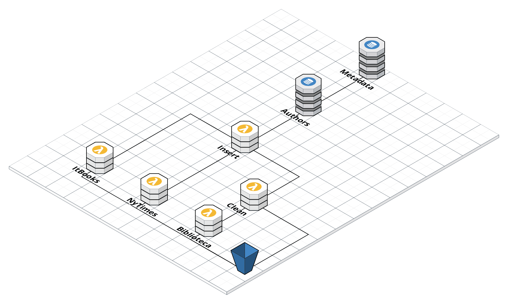

# Authors Homogenization 
```
📦authors-homogenization 
 ┣ 📂flows
 ┃ ┣ 🐍 apis_flow.py
 ┃ ┣ 🐍 biblioteca_flow.py
 ┣ 📂lambda
 ┃ ┣ 📂clean-books-biblioteca
 ┃ ┃ ┣ 🐳 Dockerfile
 ┃ ┃ ┣ 🐍 app.py
 ┃ ┃ ┗ 📜requirements.txt
 ┃ ┣ 📂get-books-biblioteca-nacional
 ┃ ┃ ┣ 🐳 Dockerfile
 ┃ ┃ ┣ 🐍 app.py
 ┃ ┃ ┗ 📜requirements.txt
 ┃ ┣ 📂get-books-itbooks
 ┃ ┃ ┣ 🐳 Dockerfile
 ┃ ┃ ┣ 🐍 app.py
 ┃ ┃ ┗ 📜requirements.txt
 ┃ ┣ 📂get-books-nytimes
 ┃ ┃ ┣ 🐳 Dockerfile
 ┃ ┃ ┣ 🐍 app.py
 ┃ ┃ ┗ 📜requirements.txt
 ┃ ┣ 📂insert-book
 ┃ ┃ ┣ 🐳 Dockerfile
 ┃ ┃ ┣ 🐍 app.py
 ┃ ┃ ┗ 📜requirements.txt
 ┃ ┗ 📂update-table
 ┃ ┃ ┣ 🐳 Dockerfile
 ┃ ┃ ┣ 🐍 app.py
 ┃ ┃ ┗ 📜requirements.txt
 ┣ 📂scripts
 ┃ ┣ 📜prefect_agent_init.sh
 ┃ ┗ 📜register_flows.sh
 ┣ 📜README.md
 ┣ 📜serverless.yml
```
## Infraestructura
La infraestructura ha sido definida como IaC (Infrastructure as Code) usando Serverless Framework y puede ser encontrada en `serverless.yml`.


### Lambda
* `get-books-it-books`: llama a la API de ItBooks, filtra los libros que ya existen en nuestra base de datos, los limpia y los guarda en S3 con el siguiente formato: `clean/{autor}/{isbn13}.json`. Tambien guarda el archivo crudo que recibe en: `raw/itbooks-api/{date}.json`
* `get-books-nytimes`: llama a la API de NyTimes y realiza un proceso similar a la lambda anterior. Los datos en crudo se guardan en: `raw/nytimes-api/{date}/{category}.json`
* `get-books-biblioteca-nacional`: hace web scraping a la pagina de la bilbioteca nacional y descarga un archivo .zip que contiene los manuscritos en diferentes archivos .csv. Comprueba usando si hash si ya existe en S3, si no, guarda el archivo en crudo en `raw/biblioteca-nacional/{hash}.zip`. Ademas, extrae los .csv del .zip y los guarda en `unzip/{nombre}.csv`
* `clean-books-biblioteca`: limpia un .csv proveniente del .zip anteriormente mencionado y guarda la informacion de los libros en `clean/{autor}/{idBNE}.json`
* `insert-book`: se encarga de insertar los libros en la tabla llamada **authors** en DynamoDB
* `update-table`: se encarga de actualizar una segunda tabla de DynamoDB llamada **metadata-authors** cada vez que se actualiza la tabla **authors**.

### DynamoDB
* `authors`: guarda informacion de los autores y los libros:
    - Partition key: author
    - Sort key: title
    - Global Secondary Index: isbn13
* `metadata-authors`: guarda informacion sobre los autores y el numero de libros que han publicado segun `authors`:
    - Partition key: author
 ### S3
 * `authors-and-books`: S3 bucket en el que se guardan tanto los datos en crudo como limpios

 ### ECR
 * ECR repository en el que se guardan las imagenes de nuestras lambdas

## Orquestacion
Todo este proceso esta orquestado mediante **Prefect**. Como storage usamos este mismo repositorio y se ejecuta en un agente local. Ambos flujos estan registrados en Prefect Cloud.

Hemos definido dos flujos:
* `apis_flow`: flujo encargado de llamar a las apis de ItBook y NyTimes. Tambien se encarga de insertar los libros en la tabla `authors`
* `biblioteca_flow`: flujo encargado de obtener los libros de la biblioteca nacional, limpiarlos e insertarlos en la tabla `authors`

Hemos creado 2 scripts para trabajar con prefect de forma mas comoda:
* `scripts/prefect_agent_init.sh`: inicializa el agente de prefect que ejecutara las tareas
* `scripts/register_flows.sh`: lista los flows de `flows/` y deja al usuario escoger que flow registrar. Todos los flows se registran en el mismo proyecto y asume que se esta ejecutando desde la raiz del repositorio.
<!--
title: 'AWS Python Example'
description: 'This template demonstrates how to deploy a Python function running on AWS Lambda using the traditional Serverless Framework.'
layout: Doc
framework: v3
platform: AWS
language: python
priority: 2
authorLink: 'https://github.com/serverless'
authorName: 'Serverless, inc.'
authorAvatar: 'https://avatars1.githubusercontent.com/u/13742415?s=200&v=4'


# Serverless Framework AWS Python Example

This template demonstrates how to deploy a Python function running on AWS Lambda using the traditional Serverless Framework. The deployed function does not include any event definitions as well as any kind of persistence (database). For more advanced configurations check out the [examples repo](https://github.com/serverless/examples/) which includes integrations with SQS, DynamoDB or examples of functions that are triggered in `cron`-like manner. For details about configuration of specific `events`, please refer to our [documentation](https://www.serverless.com/framework/docs/providers/aws/events/).

## Usage

### Deployment

In order to deploy the example, you need to run the following command:

```
$ serverless deploy
```

After running deploy, you should see output similar to:

```bash
Deploying aws-python-project to stage dev (us-east-1)

✔ Service deployed to stack aws-python-project-dev (112s)

functions:
  hello: aws-python-project-dev-hello (1.5 kB)
```

### Invocation

After successful deployment, you can invoke the deployed function by using the following command:

```bash
serverless invoke --function hello
```

Which should result in response similar to the following:

```json
{
    "statusCode": 200,
    "body": "{\"message\": \"Go Serverless v3.0! Your function executed successfully!\", \"input\": {}}"
}
```

### Local development

You can invoke your function locally by using the following command:

```bash
serverless invoke local --function hello
```

Which should result in response similar to the following:

```
{
    "statusCode": 200,
    "body": "{\"message\": \"Go Serverless v3.0! Your function executed successfully!\", \"input\": {}}"
}
```

### Bundling dependencies

In case you would like to include third-party dependencies, you will need to use a plugin called `serverless-python-requirements`. You can set it up by running the following command:

```bash
serverless plugin install -n serverless-python-requirements
```

Running the above will automatically add `serverless-python-requirements` to `plugins` section in your `serverless.yml` file and add it as a `devDependency` to `package.json` file. The `package.json` file will be automatically created if it doesn't exist beforehand. Now you will be able to add your dependencies to `requirements.txt` file (`Pipfile` and `pyproject.toml` is also supported but requires additional configuration) and they will be automatically injected to Lambda package during build process. For more details about the plugin's configuration, please refer to [official documentation](https://github.com/UnitedIncome/serverless-python-requirements).
-->
